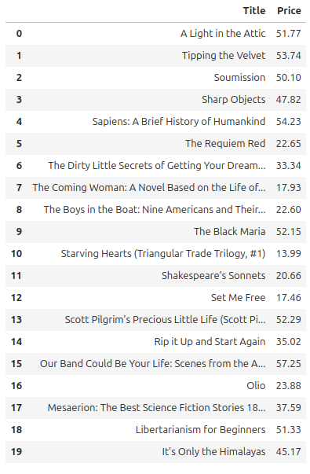

# Extração de Títulos e Preços de Livros

Este projeto tem como objetivo extrair os títulos e preços dos livros de um site, remover o símbolo "£" dos preços e convertê-los para o formato `float`. Os dados extraídos são armazenados em um DataFrame do Pandas e exibidos na tela.

## Tecnologias utilizadas
- Python
- Pandas
- Web Scraping

## Funcionalidades
1. Extração dos títulos e preços dos livros.
2. Processamento dos dados para remoção do símbolo "£" e conversão para `float`.
3. Criação de um DataFrame utilizando a biblioteca Pandas.
4. Exibição dos dados extraídos.

